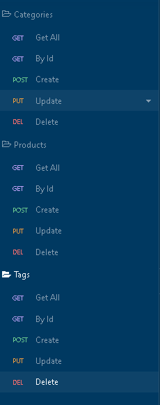

# Backyard Again
[](./LICENSE)
[](https://nodejs.org/)
[](https://www.npmjs.com/package/mysql2)
[](https://sequelize.org/)
[](https://eslint.org/)
[](https://prettier.io/)
[](http://expressjs.com/)

## Table Of Contents
- [Description](#description)
- [Roadmap](#roadmap)
- [Installation](#installation)
  - [Dependencies](#dependencies)
  - [Clone](#clone)
  - [Zip](#zip)
- [Usage](#usage)
  - [Start](#start)
  - [Easy Seed and Configuration Setup](#easy-seed-and-configuration-setup)
  - [Login](#login)
- [Contact Me](#contact-me)
- [Experiences](#experiences)
  - [Object Oriented Programming](#object-oriented-programming)
  - [Sequelize Models](#sequelize-models)
  - [ShellScripts](#shellscripts)
- [License](#license)
## Description
This project was neat to create.  I went through and worked with Sequelize
for the first time.  I utilized ShellScript as part of the setup.  It
basically creates and installs the back end for an eCommerce.  You can find a  
walkthrough video [here](https://youtu.be/ZEm7VYBAwn8).
## Roadmap

- [x]  Create a schema file
- [x]  Implement Schema file with ShellScript
- [x]  Implement .env file creation with ShellScript
- [x]  Implement seed method
- [x]  Create the four models
- [x]  Create the four routes
- [x]  Create a class that can create and handle all four models
- [x]  Create a Routes in Insomnia and export the file
- [x]  Create walkthrough video

## Installation

You will need to have Nodejs installed along with Node Package Manager(NPM)  You can
find some links below on how to install Node and NPM on Windows, Linux, and macOS.
### Dependencies
[](https://nodejs.org/en/download/)
* [How to Install Node.js and NPM on Windows - phoenixNAP](https://phoenixnap.com/kb/install-node-js-npm-on-windows)
* [How to install Node.js and npm on macOS - newline](https://www.newline.co/@Adele/how-to-install-nodejs-and-npm-on-macos--22782681)
* [How To Install Node.js on Ubuntu 20.04 - DigitalOcean](https://www.digitalocean.com/community/tutorials/how-to-install-node-js-on-ubuntu-20-04)
### Clone
Assuming you have Node and NPM you can clone this GitHub repo, go into the directory,
and install the package.json file with NPM.
```bash
git clone https://github.com/DevJonTaylor/backyard-again.git
cd gen-me-read
npm install
```
### Zip
Another method is to download the zip file, unzip the contents to a specific directory
and install the package.json file.

These commands that work on all three. (Windows, macOS, Linux) assuming they have
curl & tar.  Which newer version of Windows have.
```bash
curl -L -o backyard-again.zip https://github.com/DevJonTaylor/backyard-again/archive/refs/heads/main.zip
unzip backyard-again.zip
cd backyard-again-main
npm install
```
    ## Usage/Examples
You see a demo video [here](https://www.youtube.com/watch?v=ZEm7VYBAwn8).

## Usage
### Start
```bash
npm run start
```
### Easy Seed and Configuration Setup
I created a Shell Script that prompts the user for their MySQL username and password.
Which then turns around and creates the .env file and runs the schema.sql.  Then seeds
the tables
```bash
npm run schema:seed
```

### Login
I exported the Insomnia.json for easy import and quick testing.


## Contact Me

- **Phone/SMS**: [(512)740-9784](tel:+15127409784/)
- **Email**: [jonnytest1101@icloud.com](mailto:jonnytest1101@icloud.com)
- **GitHub**: [@DevJonTaylor](https://www.github.com/devjontaylor)
- **LinkedIn**: [Vue-Shell](https://www.linkedin.com/in/vue-shell)
## Experiences

### Object Oriented Programming
I took my OOP to the next level.  This was interesting because one class controls all of
the routes and handles errors in the requests.  It was fun and super neat to watch as it
expanded through out the project.
### Sequelize Models
I really enjoy the concept and idea behind the Model.  I keep wanting to add more to the
Model class itself.  I think the next time I'll create a class that takes in the model
and builds off of the Model's themselves and connects them with the routes.
### ShellScripts
This was my first project implementing a ShellScript with the project.json.  Connecting
it with the prompt for credentials was super idea because it really allows for a smooth
setup in my opinion.

## License
[](./LICENSE)